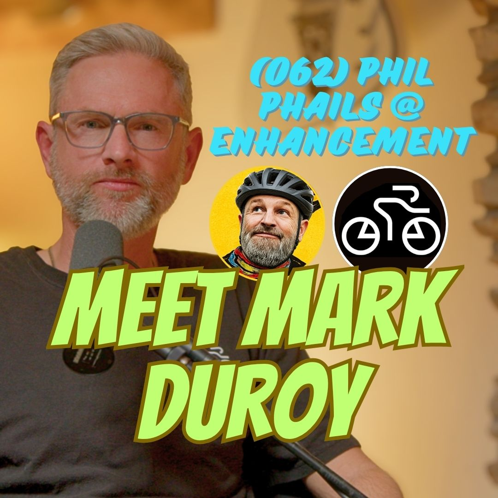

## How Cycling Enhances Your Life: Lessons from Pro Cyclist Mark Duroy

*Mark Duroy shares how cycling helped him navigate ADHD, sobriety, and career pivots. Discover why cycling should enhance your life.* 

I sat down with Mark Duroy—former professional cyclist, USA Cycling certified coach, and founder of Velo Savvy—for a conversation that went far deeper than training plans and race tactics. What started as a chat about bikes turned into a honest discussion about ADHD, breaking cycles from childhood, getting sober, and using movement as a foundation for a better life.

Mark’s core philosophy is simple but powerful: cycling should enhance your life. Not complicate it, not drain it, but genuinely make it richer. That idea stuck with me.

### From Impulsivity to Investment

I opened up early in the conversation about growing up with ADHD in a divorced family and the moment I realized I was repeating old patterns as a parent. The impulsivity, inattentiveness, and high energy that come with ADHD had shaped so much of my life—until I started taking ownership of my choices.

Cycling, especially endurance riding and group rides, channels that energy productively. It pairs movement with community in a way that feels safe and rewarding. Group rides in Austin became a place for small, meaningful conversations and real social connection without pressure.

He’s seen it repeatedly: high-energy people often thrive in endurance sports. The sport self-selects for what you’re naturally good at.

### Sobriety, Clarity, and Second Acts

One of the most compelling parts of the conversation was Mark’s journey to sobriety. After years of using alcohol and weed to manage anxiety and unwind from high-pressure tech roles (including time at Amazon in logistics technology), he quit completely in 2022.

The benefits showed up fast: clearer thinking, better physical recovery, improved relationships, and more presence as a husband and father. Cycling played a supporting role in this new chapter—providing a healthy, demanding focus that replaced old coping mechanisms.

Hearing him describe trading late-night drinking for early rides and structured training reminded me how powerful it is when movement becomes medicine.

### The Pro Racer Turned Coach

Mark raced professionally in Europe—events like Rund um Köln and others in the Netherlands and Germany. After a serious crash and a big career move, he stepped away from racing but never from the bike. Today, through Velo Savvy, he coaches cyclists of all levels in Austin, from beginners who just don’t want to get dropped on group rides to juniors with serious race ambitions.

He works with Violent Crown and leads rides for Hill Climbers, a professional networking group that happens to ride bikes. Whether it’s helping someone finish a longer ride or guiding mountain bike racers onto the road, his approach stays consistent: meet people where they are and help cycling enhance their life.

### Movement as Meditation and Community

We talked about cycling as moving meditation. Long solo rides create space to think, process, or simply be present with the wind and surroundings. Group rides build something different—trust, camaraderie, even what Mark described as a kind of “trauma bond” from pushing through hard efforts together.

He’s also a proponent of strength training and stretching to stay injury-free and functional beyond the bike. As someone who once focused almost exclusively on cycling-specific training, he now sees the value in a more balanced approach.

### My Personal Takeaways

Mark’s story challenged me to think differently about “enhancement.” It’s easy to fill life with activities that feel productive but actually drain us. Cycling, when done right, does the opposite. It demands time and sacrifice but returns energy, clarity, relationships, and confidence.

I was struck by how deliberately Mark has built his life around things that serve his values—movement, community, family, and growth. His transition from high-pressure tech to coaching felt less like a career change and more like alignment.

### Practical Takeaways You Can Use

- ***Start where you are.** You don’t need to race or ride epic miles. Consistent group rides or solo time on the bike can create huge mental shifts.
- **Pair movement with people.** Community makes the hard parts more sustainable and the good parts more enjoyable.
- **Invest, don’t just spend time.** Reframe training or riding as an investment in your health, mindset, and relationships.
- **Address coping mechanisms.** If substances (or anything else) are managing your energy or anxiety, consider healthier outlets like cycling and professional support.
- **Build the whole athlete.** Add strength training and mobility work to stay strong and reduce injury risk.
- **Focus on enhancement.** Regularly ask: Is this activity making my life better overall?

### Final Thoughts

Mark Duroy reminded me that the best versions of ourselves often emerge not through force of will alone, but through consistent, meaningful practices that align with how we’re wired. For him, that’s been cycling. For others, it might be something else—but the principle holds: choose activities that genuinely enhance your life.

If you’re in Austin or looking for guidance on the bike, check out Mark’s work at [Velo Savvy](https://www.velo-savvy.com/).

### About Mark Duroy

Mark Duroy is a former professional cyclist who raced extensively across Europe in events including Rund um Köln, Ronde van Boxmeer, and Ronde van Gelderland. Today, as a USA Cycling certified coach and founder of Velo-Savvy, he works with cyclists of all levels, from beginners to experienced racers looking for podium results. Drawing on decades of experience, he helps athletes improve performance, refine race strategy, and build mental resilience to achieve their goals and find greater enjoyment in the sport.

👉 Find Mark:
- website: http://velo-savvy.com/
- facebook: https://www.facebook.com/mark.duroy
- Instagram: https://www.instagram.com/velo_savvy/
- strava: https://www.strava.com/clubs/1357604

